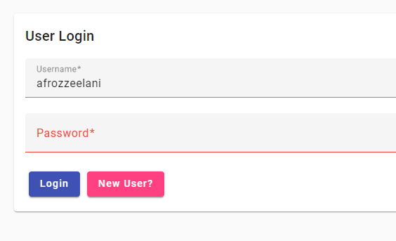
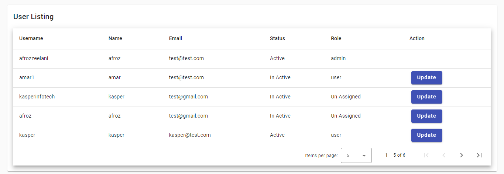
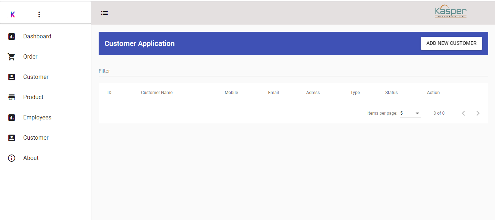
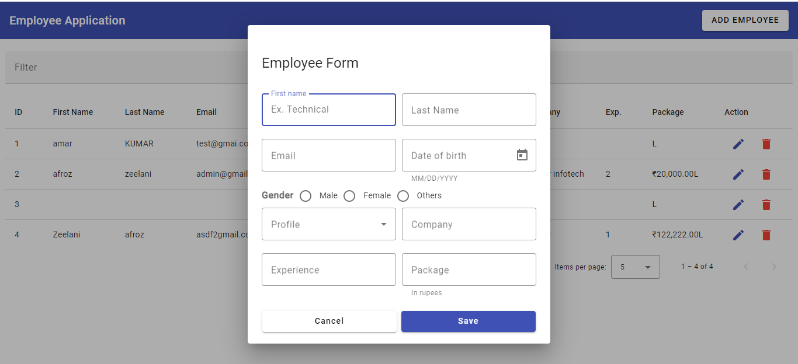
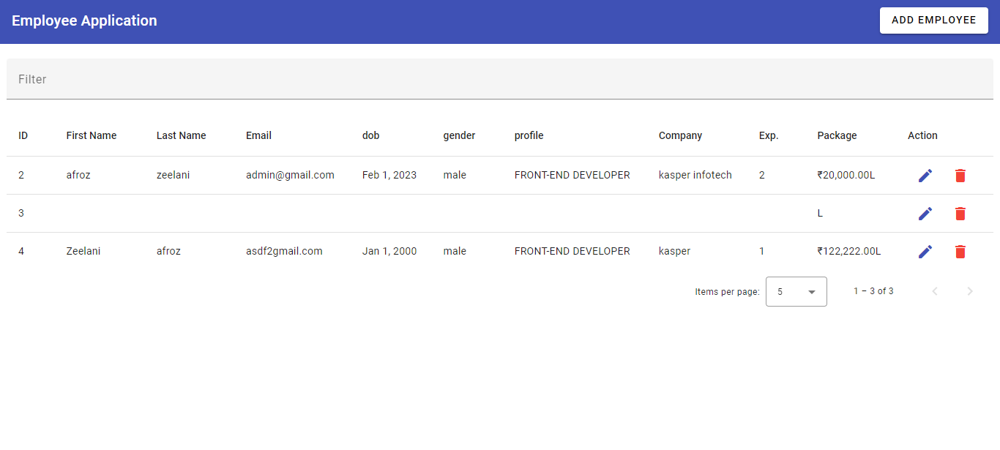

# CRM App

#### Screenshots









## Build & Setup

```bash
# Clone project
git clone https://github.com/zeelani007/casper.git


# Install Angular CLI
npm install -g @angular/cli

# prepare Json-Server as fake Restful API
cd ng-crm


# Install the packages with npm
npm install


# Start the app with npm
npm start
# Or use ng
ng serve 

# Test with npm
npm run test
# Or use ng
ng test


# build for production 
npm run build --prod=true

# run as production
install -g serve
serve dist

```

## Welcome to fork or clone!

For detailed explanation on how things work, checkout following links please.

* [angular](https://angular.io/)
* [angular-material](https://material.angular.io/)
* [ng-charts](https://github.com/valor-software/ng2-charts)
* [rxjs](https://rxjs.dev/api)